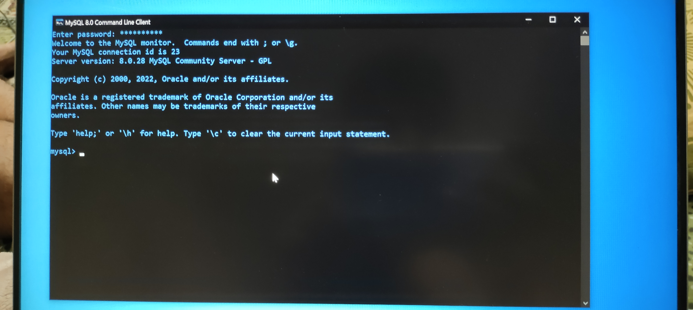
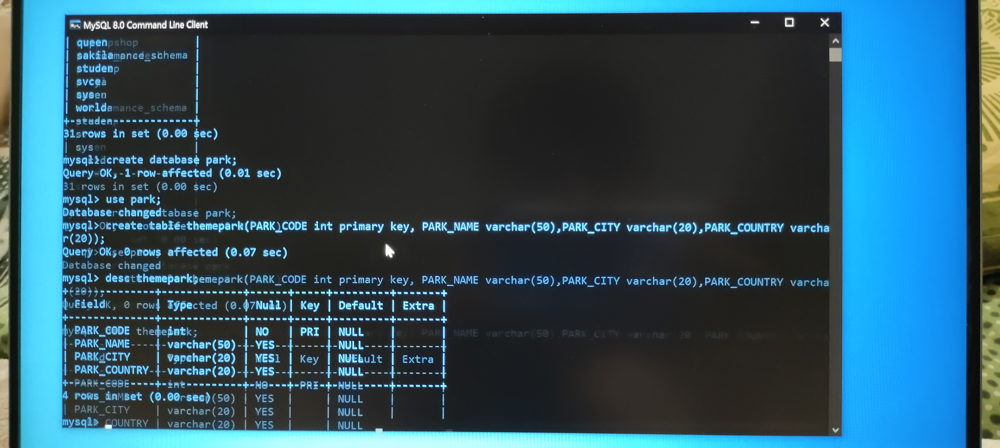
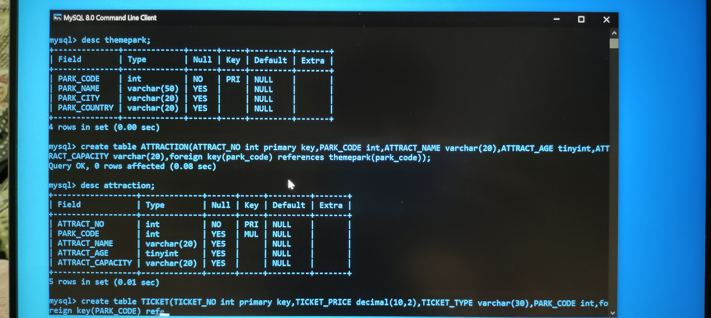
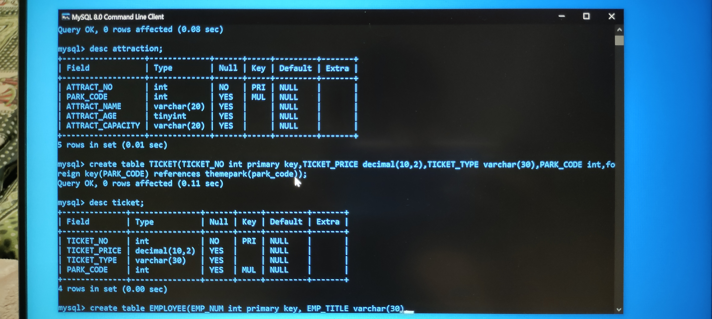

# Auto-Create-database

<figure class="video_container">
  <video controls="true" allowfullscreen="true" poster="">
    <source src="img/video_20220614_234207.mp4" type="video/mp4">
  </video>
</figure>

